<div align="center">
<h1>SLITHERS (State planner using LIe THEory for RoboticS)</h1>

[**William Smith**](https://www.linkedin.com/in/williamsmithv/)<sup>1*</sup> · [**Siddharth Singh**](https://30siddharth.github.io/)<sup>2</sup> · [**Julia Rudy**](https://www.linkedin.com/in/julia-rudy/)<sup>2</sup> · [**Yuxiang Guan**](https://www.linkedin.com/in/yuxiangguan/)<sup>3</sup>

<sup>1</sup>Applied Research Associates&emsp;&emsp;&emsp;<sup>2</sup>University of Virginia&emsp;&emsp;&emsp;<sup>3</sup>University of Texas at Dallas
<br>
*corresponding author

<a href="https://arxiv.org/abs/2410.15443"></a>
<a href="https://opensource.org/license/mit"></a>
</div>

<figure>
    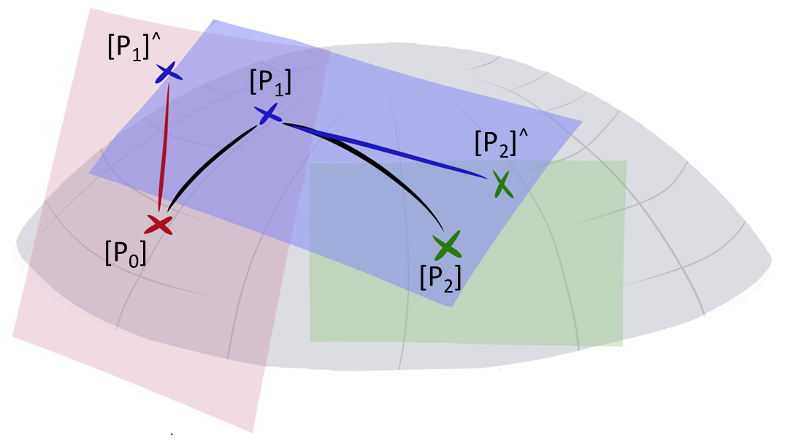
    <figcaption><em>Pictorial representation of using Lie theory to move across the Lie group using the corresponding Lie algebra. The motion in between each point on the Lie group (manifold) can be represented as a motion on the corresponding Lie algebra (tangent surface).</em></figcaption>
</figure>
<br/><br/>

We present SLITHERS (State planner using LIe THEory for RoboticS), a Lie theory based optimization approach for state planning of mobile manipulators. 
Given the sequence of end effector poses, SLITHERS solves for the joint values incrementally using kinematic constraints found through Lie theory. 
The joint state values are estimated by solving a constrained optimization problem which yields the sequence of states given the current pose and desired pose. 
In this study, our contribution is three-folds: 

1) Firstly, we successfully developed a new state planner given unrestricted motion in high degrees of freedom, 
2) SLITHERS is generalizable and can be easily adjusted for mobile manipulators of multiple degrees of freedom, 
3) and lastly SLITHERS guarantees smoothness in the joint states with unified motion between the base and manipulator. 

<figure>
    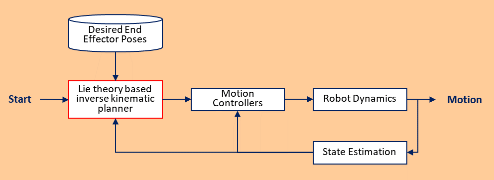
    <figcaption><em>The framework of SLITHERS which takes in a set of desired end effector poses, computes the desired state based off of an objective function, and executes the motion to achieve the desired states.</em></figcaption>
</figure>
<br/><br/>

## Directories

### lie_theory

The `lie_theory` directory contains the main files and functions for solving inverse kinematics. The main functionality of the repository is located here.

### coppeliasim

The `coppeliasim` directory contains the files and scenes to run simulations with the tested robot models. The code for simulations is set up to run open loop by precomputing the states and playing them back.

### robot_models

The `coppeliasim` directory contains the robot model files (`urdf`, `dae`, `stl`, etc).

### kinematic

The `kinematics` directory contains the orginal code and inspiration for shifting to the Lie Theory based optimization.

### export_fig

The `export_fig` directory contains a copy of [export_fig](https://github.com/altmany/export_fig) for generating figures.

## Experimental Validation

<figure>
    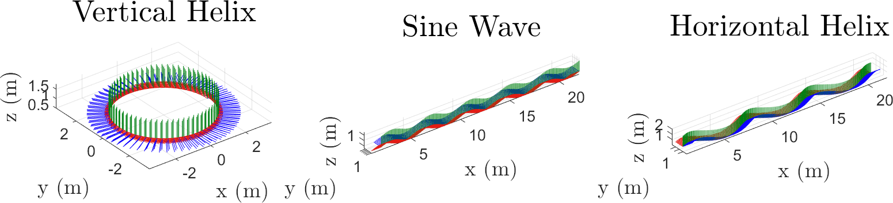
    <figcaption><em>Test paths used for the simulated experiment with the colored axes representing the desired pose of the end effector. The red, blue, and green axes represent the x, y, and z axes, respectively.</em></figcaption>
</figure>
<br/><br/>

<figure>
    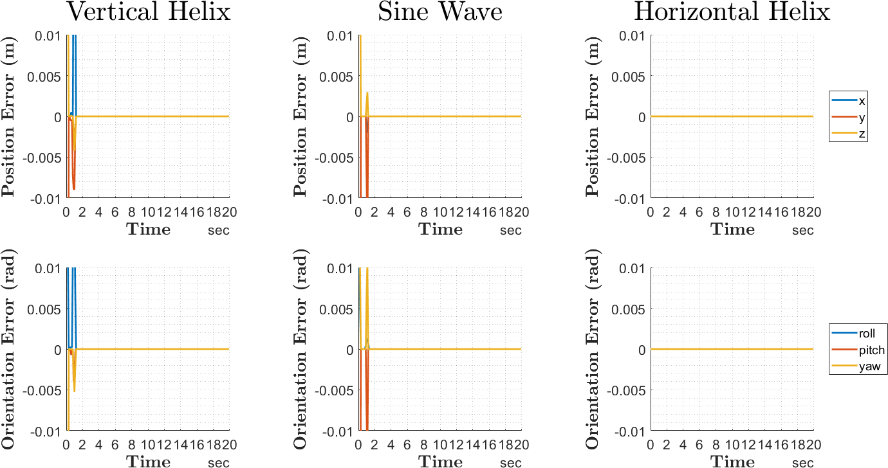
    <figcaption><em>The error of the end effector on each of the different paths for both the position and orientation when using a non-holonomic mobile platform and computed by the proposed method.</em></figcaption>
</figure>
<br/><br/>

<figure>
    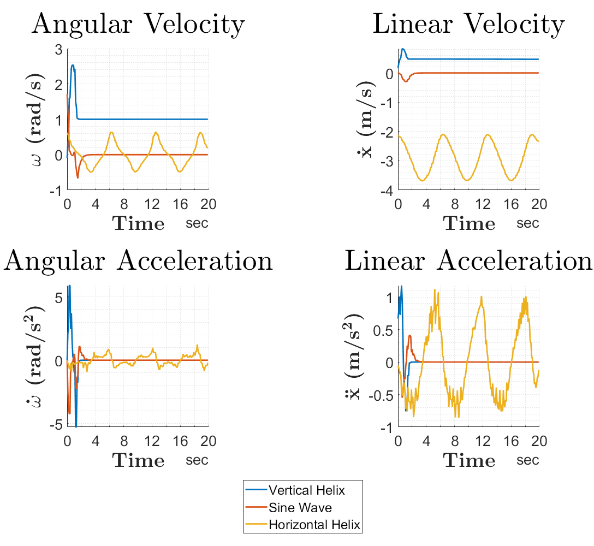
    <figcaption><em>The computed angular and linear velocity for the mobile manipulator with a non-holonomic base using the proposed method.</em></figcaption>
</figure>
<br/><br/>

<figure>
    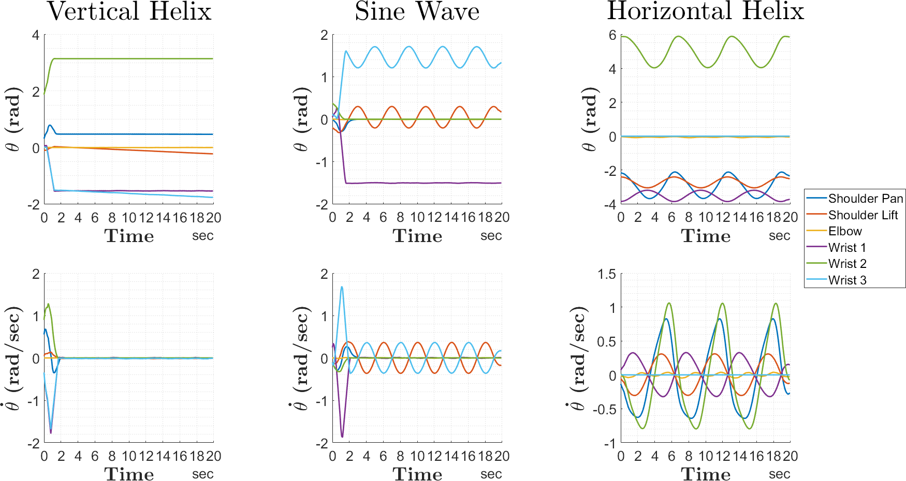
    <figcaption><em>The computed joint states for the robotic manipulator mounted on the non-holonomic base using the proposed method.</em></figcaption>
</figure>
<br/><br/>

<figure>
    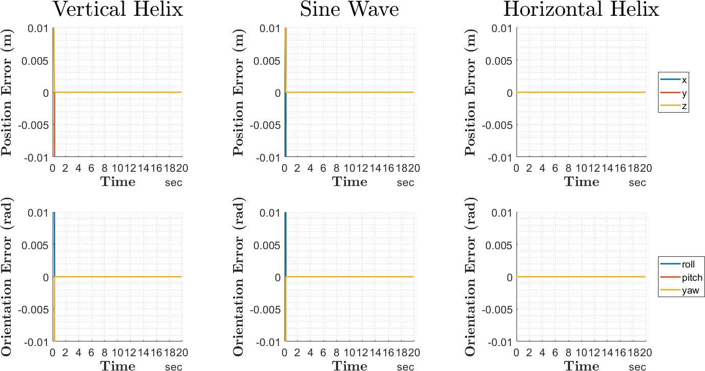
    <figcaption><em>The error of the end effector on each of the different paths for both the position and orientation when using a holonomic mobile platform and computed by the proposed method.</em></figcaption>
</figure>
<br/><br/>

<figure>
    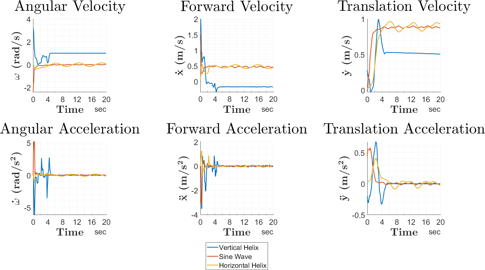
    <figcaption><em>The computed angular and linear velocities for the mobile manipulator with a holonomic base using the proposed method. The forward and translational velocities represent the velocities in the x and y direction with respect to the base frame, respectively.</em></figcaption>
</figure>
<br/><br/>

<figure>
    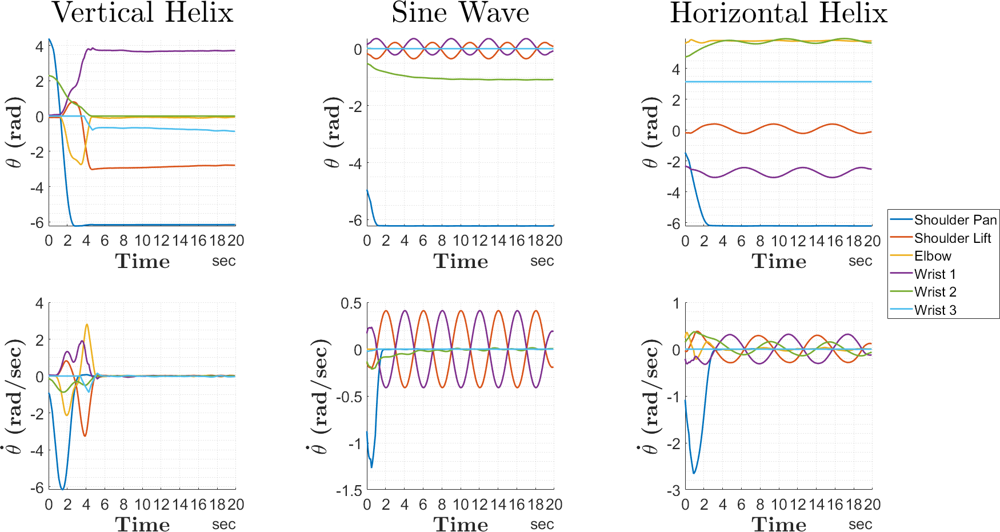
    <figcaption><em>The computed joint states for the robotic manipulator mounted on the holonomic base using the proposed method.</em></figcaption>
</figure>
<br/><br/>

<table>
    <caption><b>Summarized metrics and results from the simulated experiment when testing the state planner on mobile manipulators.</b></caption>
    <thead>
        <tr>
            <th colspan=1>Mobile Base Configuration</th>
            <th colspan=3>Non-holonomic</th>
            <th colspan=3>Holonomic</th>
        </tr>
        <tr>
            <th>Trajectories</th>
            <th>Vertical Helix</th>
            <th>Sine Wave</th>
            <th>Horizontal Helix</th>
            <th>Vertical Helix</th>
            <th>Sine Wave</th>
            <th>Horizontal Helix</th>
        </tr>
    </thead>
    <tbody>
        <tr>
            <td>Position RMSE (m)</td>
            <td>0.0415</td>
            <td>0.0299</td>
            <td>0.0031</td>
            <td>0.0472</td>
            <td>0.0147</td>
            <td>0.0094</td>
        </tr>
        <tr>
            <td>Rotation RMSE (rad)</td>
            <td>0.0214</td>
            <td>0.0159</td>
            <td>0.0016</td>
            <td>0.0199</td>
            <td>0.2841</td>
            <td>0.0011</td>
        </tr>
        <tr>
            <td>Computation Time (s)</td>
            <td>0.1862</td>
            <td>0.1092</td>
            <td>0.1216</td>
            <td>0.1572</td>
            <td>0.1075</td>
            <td>0.1312</td>
        </tr>
        <tr>
            <td>Max Forward Velocity (m/s)</td>
            <td>0.8317</td>
            <td>0.3004</td>
            <td>3.6881</td>
            <td>2.0000</td>
            <td>1.4923</td>
            <td>0.5514</td>
        </tr>
        <tr>
            <td>Max Translation Velocity (m/s)</td>
            <td>-</td>
            <td>-</td>
            <td>-</td>
            <td>0.9933</td>
            <td>0.9028</td>
            <td>0.9650</td>
        </tr>
        <tr>
            <td>Max Angular Velocity (rad/s)</td>
            <td>2.5299</td>
            <td>1.7195</td>
            <td>0.6449</td>
            <td>3.1416</td>
            <td>2.4128</td>
            <td>0.4185</td>
        </tr>
        <tr>
            <td>Max Forward Acceleration (m/s$^2$)</td>
            <td>1.1774</td>
            <td>0.5491</td>
            <td>1.1238</td>
            <td>3.4888</td>
            <td>3.1030</td>
            <td>1.2341</td>
        </tr>
        <tr>
            <td>Max Translation Acceleration (m/s$^2$)</td>
            <td>-</td>
            <td>-</td>
            <td>-</td>
            <td>0.6746</td>
            <td>0.5749</td>
            <td>0.4107</td>
        </tr>
        <tr>
            <td>Max Ang Accel (rad/s$^2$)</td>
            <td>5.8892</td>
            <td>4.2186</td>
            <td>1.2413</td>
            <td>6.1535</td>
            <td>5.1969</td>
            <td>1.0681</td>
        </tr>
        <tr>
            <td>Max Forward Jerk (m/s$^3$)</td>
            <td>5.8309</td>
            <td>1.5568</td>
            <td>3.4703</td>
            <td>24.6442</td>
            <td>15.3703</td>
            <td>11.4400</td>
        </tr>
        <tr>
            <td>Max Translation Jerk (m/s$^3$)</td>
            <td>-</td>
            <td>-</td>
            <td>-</td>
            <td>1.1581</td>
            <td>0.6296</td>
            <td>0.3900</td>
        </tr>
        <tr>
            <td>Max Angular Jerk (rad/s$^3$)</td>
            <td>23.7865</td>
            <td>19.4592</td>
            <td>6.7439</td>
            <td>36.1791</td>
            <td>25.6212</td>
            <td>3.4932</td>
        </tr>
        <tr>
            <td>Max Joint Velocity (rad/s)</td>
            <td>1.7848</td>
            <td>1.8732</td>
            <td>1.0609</td>
            <td>6.1663</td>
            <td>1.2688</td>
            <td>2.6576</td>
        </tr>
        <tr>
            <td>Max Joint Acceleration (rad/s$^2$)</td>
            <td>1.9905</td>
            <td>2.5079</td>
            <td>1.1399</td>
            <td>5.4608</td>
            <td>1.4042</td>
            <td>1.8988</td>
        </tr>
        <tr>
            <td>Max Joint Jerk (rad/s$^3$)</td>
            <td>10.0259</td>
            <td>7.9320</td>
            <td>2.6727</td>
            <td>9.6929</td>
            <td>2.7737</td>
            <td>3.4553</td>
        </tr>
    </tbody>
</table>

## Manipulator Kinematics

Lie theory is useful to model manipulator kinematics and dynamics due to is generic format and wide applications.

### Screw Coordinates

A twist, $\mathbf{S} \in \mathbb{R}^6$, is a screw composed of two three dimensional vectors, the rotational and translational motion about an axis, as given by
```math
\begin{equation}
    \mathbf{S} =    \begin{Bmatrix}
                        \boldsymbol{\omega} \\
                        \mathbf{v} + \mathbf{d} \times \boldsymbol{\omega}
                        \end{Bmatrix} 
\end{equation}
```
where $\boldsymbol{\omega} \in \mathbb{R}^3$ is the angular motion, $\mathbf{v} \in \mathbb{R}^3$ is the linear motion, and $\mathbf{d} \in \mathbb{R}^3$ is a translation from the reference frame to the joint. 
In a revolute joint ($\mathbf{v}=\mathbf{0}$), the twist element, $\mathbf{S}_{\omega}$, is defined by rotational motion and translational vectors as given by 
```math
\begin{equation}
    \mathbf{S}_{\omega} =    \begin{Bmatrix}
                        \boldsymbol{\omega} \\
                        \mathbf{d} \times \boldsymbol{\omega}
                        \end{Bmatrix} 
\end{equation}
```
A prismatic joint ($\boldsymbol{\omega}=\mathbf{0}$) has a twist element, $\mathbf{S}_{v}$, defined by the linear motion vector as given by
```math
\begin{equation}
    \mathbf{S}_{v} =    \begin{Bmatrix}
                        \mathbf{0} \\
                        \mathbf{v}
                        \end{Bmatrix} 
\end{equation}
```
The defined screw coordinates can then be used to compute the forward and inverse kinematics from the fundamentals of Lie theory using the product of exponentials. 

### Lie Groups and Lie Algebra

In the case of a three dimensional rigid body transformation, $[\mathbf{P}] \in SE(3)$, any element in the Lie group can be defined by a rotation matrix, $[\mathbf{R}]$, and translation vector, $\mathbf{t}$, as given by
```math
\begin{equation}
    [\mathbf{P}] = \begin{bmatrix}
[\mathbf{R}] & \mathbf{t} \\
\mathbf{0} & 1
\end{bmatrix} 
\end{equation}
```
The Lie algebra, $[\mathbf{S}]^{\wedge} \in \mathfrak{se}(3)$, for a homogeneous transformation is defined by the twist governing the motion and given by
```math
\begin{equation}
    [\mathbf{S}]^{\wedge} = \begin{bmatrix}
[\boldsymbol{\omega}]_{\times} & \mathbf{v} + \mathbf{d} \times \boldsymbol{\omega} \\
\mathbf{0} & 0
\end{bmatrix} 
\end{equation}
```
where $[\cdot]_{\times}$ indicates a skew symmetric matrix.

The matrix exponential is used to map $[\mathbf{S}(q)]^{\wedge}$ onto the $SE(3)$ manifold changing the pose from $[\mathbf{P}_{0}]$ to $[\mathbf{P}]$ as given by
```math
\begin{equation}
    [\mathbf{P}] = e^{[\mathbf{S(q)}]^{\wedge}} [\mathbf{P}_{0}] 
\end{equation}
```
where $[\mathbf{P}_{0}]$ is the configuration state at the identity and $S$ is a function of $q$, the joint state.
For a manipulator, the product of exponentials is used to solve for the forward kinematics as given by
```math
\begin{equation}
    [\textbf{P}_{n}^{0}] = \prod_{i \in n} \left( e^{[\mathbf{S}_{i}(q_{i})]^{\wedge}} \right) [\mathbf{P}_{0}] 
\end{equation}
```
where $n$ is the number of links in the robotic system. 

### Derivations of Forward Kinematics

#### Differential Drive Mobile Robot

<figure>
    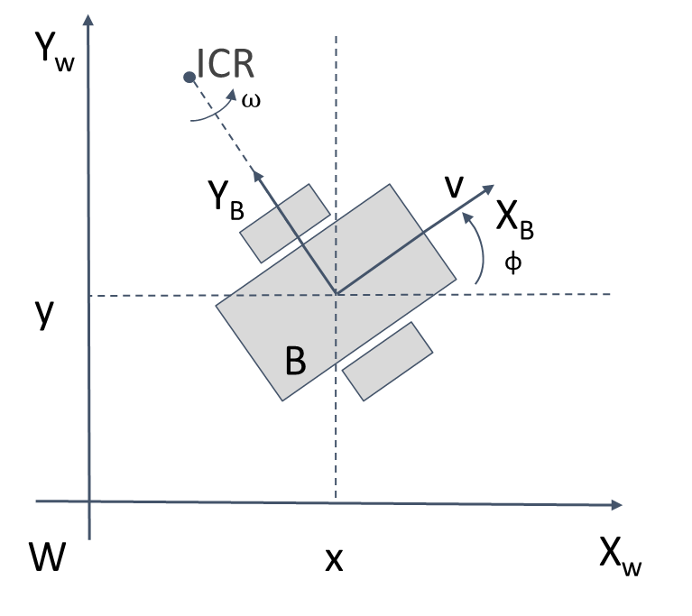
    <figcaption><em>Diagram of differential drive robot frame, <b>B</b>, located in the world frame, <b>W</b>, with states, x, y, and &phi;, and control inputs, v and &omega;.</em></figcaption>
</figure>
<br/><br/>

```math
\begin{equation}
    \boldsymbol{\omega} = \begin{Bmatrix}
                    0 \\
                    0 \\
                    \omega
                    \end{Bmatrix} , \qquad
    \mathbf{v} = \begin{Bmatrix}
                    v \\
                    0 \\
                    0
                    \end{Bmatrix} , \qquad
    \mathbf{d} = \begin{Bmatrix}
                    0 \\
                    0 \\
                    0
                    \end{Bmatrix} \\
\end{equation}
```

```math
\begin{equation}
    \mathbf{S} = \begin{Bmatrix}
                    0 \\
                    0 \\
                    \omega \\
                    v \\
                    0 \\
                    0
                    \end{Bmatrix}
\end{equation}
```

```math
\begin{equation}
    [\mathbf{S}]^{\wedge} = \begin{bmatrix}
                            0 & -\omega & 0 & v \\
                            \omega & 0 & 0 & 0 \\
                            0 & 0 & 0 & 0 \\
                            0 & 0 & 0 & 0
                            \end{bmatrix}
\end{equation}
```

```math
\begin{equation}
    [\Delta\mathbf{P}^{B}_{B,k}] = \begin{bmatrix}
                            \cos{\omega_k} & -\sin{\omega_k} & 0 & \frac{v_k}{\omega_k}\sin{\omega_k} \\
                            \sin{\omega_k} & \cos{\omega_k} & 0 & \frac{v_k}{\omega_k}\left(1-\cos{\omega_k}\right) \\
                            0 & 0 & 1 & 0 \\
                            0 & 0 & 0 & 1
                            \end{bmatrix} dt
\end{equation}
```

```math
\begin{equation}
    [\mathbf{P}^{B}_{0}] = \begin{bmatrix}
                            1 & 0 & 0 & 0 \\
                            0 & 1 & 0 & 0 \\
                            0 & 0 & 1 & 0 \\
                            0 & 0 & 0 & 1
                            \end{bmatrix}
\end{equation}
```

```math
\begin{equation}
    [\mathbf{P}^{W}_{B,k+1}] = [\mathbf{P}^{W}_{B,k}][\Delta\mathbf{P}^{B}_{B,k}][\mathbf{P}^{B}_{0}]
\end{equation}
```

### Mecanum  Drive Mobile Robot

<figure>
    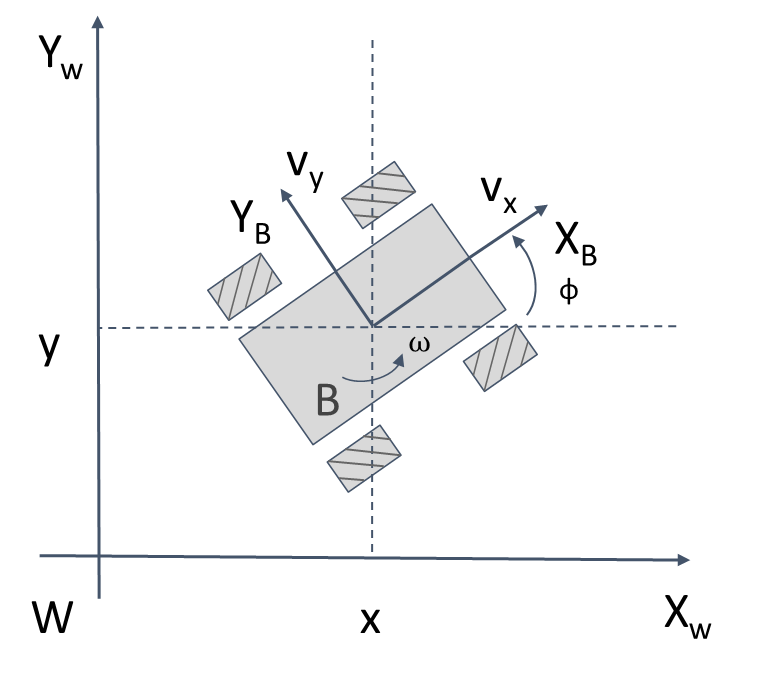
    <figcaption><em>Diagram of mecanum drive robot frame, <b>B</b>, located in the world frame, <b>W</b>, with states, x, y, and &phi;, and control inputs, v<sub>x</sub>, v<sub>y</sub>, and &omega;.</em></figcaption>
</figure>
<br/><br/>

```math
\begin{equation}
    \boldsymbol{\omega} = \begin{Bmatrix}
                    0 \\
                    0 \\
                    \omega
                    \end{Bmatrix} , \qquad
    \mathbf{v} = \begin{Bmatrix}
                    v_{x} \\
                    v_{y} \\
                    0
                    \end{Bmatrix} , \qquad
    \mathbf{d} = \begin{Bmatrix}
                    0 \\
                    0 \\
                    0
                    \end{Bmatrix} \\
\end{equation}
```

```math
\begin{equation}
    \mathbf{S} = \begin{Bmatrix}
                    0 \\
                    0 \\
                    \omega \\
                    v_{x} \\
                    v_{y} \\
                    0
                    \end{Bmatrix}
\end{equation}
```

```math
\begin{equation}
    [\mathbf{S}]^{\wedge} = \begin{bmatrix}
                            0 & -\omega & 0 & v_{x} \\
                            \omega & 0 & 0 & v_{y} \\
                            0 & 0 & 0 & 0 \\
                            0 & 0 & 0 & 0
                            \end{bmatrix}
\end{equation}
```

```math
\begin{equation}
    [\Delta\mathbf{P}^{B}_{B,k}] = \begin{bmatrix}
                            \cos{\omega_k} & -\sin{\omega_k} & 0 & \frac{v_{x,k}\sin{\omega_k}+v_{y,k}\left(\cos{\omega_k}-1\right)}{\omega_k} \\
                            \sin{\omega_k} & \cos{\omega_k} & 0 & \frac{v_{y,k}\sin{\omega_k}+v_{x,k}\left(1-\cos{\omega_k}\right)}{\omega_k} \\
                            0 & 0 & 1 & 0 \\
                            0 & 0 & 0 & 1
                            \end{bmatrix} dt
\end{equation}
```

```math
\begin{equation}
    [\mathbf{P}^{B}_{0}] = \begin{bmatrix}
                            1 & 0 & 0 & 0 \\
                            0 & 1 & 0 & 0 \\
                            0 & 0 & 1 & 0 \\
                            0 & 0 & 0 & 1
                            \end{bmatrix}
\end{equation}
```

```math
\begin{equation}
    [\mathbf{P}^{W}_{B,k+1}] = [\mathbf{P}^{W}_{B,k}][\Delta\mathbf{P}^{B}_{B,k}][\mathbf{P}^{B}_{0}]
\end{equation}
```

#### Industrial Robotic Manipulator

<figure>
    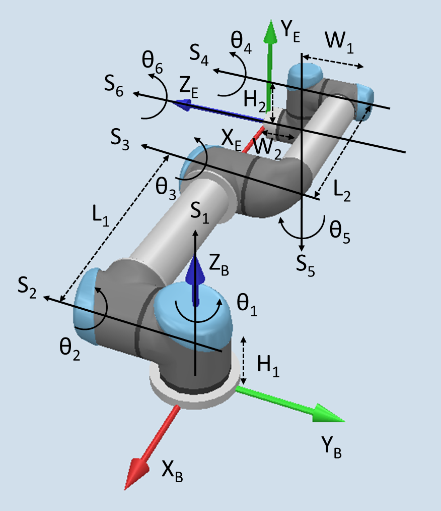
    <figcaption><em>Diagram of Universal Robot UR5 with base frame, <b>B</b>, and end effector frame, <b>E</b>, in the zero position. Screw coordinates, <b>S</b><sub>i</sub> &forall; i &isin; n, and joint angles, &theta;<sub>i</sub> &forall; i &isin; n, are used to define kinematic model of the six link manipulator, n=6.</em></figcaption>
</figure>
<br/><br/>

```math
\begin{equation}
    \boldsymbol{\omega}_{1} = \begin{Bmatrix}
                    0 \\
                    0 \\
                    \theta_{1}
                    \end{Bmatrix} , 
    \mathbf{v}_{1} = \begin{Bmatrix}
                    0 \\
                    0 \\
                    0
                    \end{Bmatrix} , 
    \mathbf{d}_{1} = \begin{Bmatrix}
                    0 \\
                    0 \\
                    0
                    \end{Bmatrix}
\end{equation}
```
```math
\begin{equation}
    \boldsymbol{\omega}_{2} = \begin{Bmatrix}
                    0 \\
                    -\theta_{2} \\
                    0
                    \end{Bmatrix} , 
    \mathbf{v}_{2} = \begin{Bmatrix}
                    0 \\
                    0 \\
                    0
                    \end{Bmatrix} , 
    \mathbf{d}_{2} = \begin{Bmatrix}
                    0 \\
                    0 \\
                    H_{1}
                    \end{Bmatrix} 
\end{equation}
```
```math
\begin{equation}
    \boldsymbol{\omega}_{3} = \begin{Bmatrix}
                    0 \\
                    -\theta_{3} \\
                    0
                    \end{Bmatrix} , 
    \mathbf{v}_{3} = \begin{Bmatrix}
                    0 \\
                    0 \\
                    0
                    \end{Bmatrix} , 
    \mathbf{d}_{3} = \begin{Bmatrix}
                    -L_{1} \\
                    0 \\
                    H_{1}
                    \end{Bmatrix} 
\end{equation}
```
```math
\begin{equation}
    \boldsymbol{\omega}_{4} = \begin{Bmatrix}
                    0 \\
                    -\theta_{4} \\
                    0
                    \end{Bmatrix} , 
    \mathbf{v}_{4} = \begin{Bmatrix}
                    0 \\
                    0 \\
                    0
                    \end{Bmatrix} , 
    \mathbf{d}_{4} = \begin{Bmatrix}
                    -L_{1}-L_{2} \\
                    0 \\
                    H_{1}
                    \end{Bmatrix} 
\end{equation}
```
```math
\begin{equation}
    \boldsymbol{\omega}_{5} = \begin{Bmatrix}
                    0 \\
                    0 \\
                    -\theta_{5}
                    \end{Bmatrix} , 
    \mathbf{v}_{5} = \begin{Bmatrix}
                    0 \\
                    0 \\
                    0
                    \end{Bmatrix} , 
    \mathbf{d}_{5} = \begin{Bmatrix}
                    -L_{1}-L_{2} \\
                    -W_{1} \\
                    0
                    \end{Bmatrix} 
\end{equation}
```
```math
\begin{equation}
    \boldsymbol{\omega}_{6} = \begin{Bmatrix}
                    0 \\
                    -\theta_{6} \\
                    0
                    \end{Bmatrix} , 
    \mathbf{v}_{6} = \begin{Bmatrix}
                    0 \\
                    0 \\
                    0
                    \end{Bmatrix} , 
    \mathbf{d}_{6} = \begin{Bmatrix}
                    -L_{1}-L_{2} \\
                    0 \\
                    H_{1}-H_{2}
                    \end{Bmatrix} 
\end{equation}
```

```math
\begin{equation}
    \mathbf{S}_{1} = \begin{Bmatrix}
                    0 &
                    0 &
                    1 &
                    0 &
                    0 &
                    0
                    \end{Bmatrix}^{\top} \theta_{1} 
\end{equation}
```
```math
\begin{equation}
    \mathbf{S}_{2} = \begin{Bmatrix}
                    0 &
                    -1 &
                    0 &
                    H_{1} &
                    0 &
                    0
                    \end{Bmatrix}^{\top} \theta_{2} 
\end{equation}
```
```math
\begin{equation}
    \mathbf{S}_{3} = \begin{Bmatrix}
                    0 &
                    -1 &
                    0 &
                    H_{1} &
                    0 &
                    L_{1}
                    \end{Bmatrix}^{\top} \theta_{3} 
\end{equation}
```
```math
\begin{equation}
    \mathbf{S}_{4} = \begin{Bmatrix}
                    0 &
                    -1 &
                    0 &
                    H_{1} &
                    0 &
                    L_{1}+L_{2}
                    \end{Bmatrix}^{\top} \theta_{4} 
\end{equation}
```
```math
\begin{equation}
    \mathbf{S}_{5} = \begin{Bmatrix}
                    0 &
                    0 &
                    -1 &
                    W_{1} &
                    -L_{1}-L_{2} &
                    0
                    \end{Bmatrix}^{\top} \theta_{5} 
\end{equation}
```
```math
\begin{equation}
    \mathbf{S}_{6} = \begin{Bmatrix}
                    0 &
                    -1 &
                    0 &
                    H_{1}-H_{2} &
                    0 &
                    L_{1}-L_{2}
                    \end{Bmatrix}^{\top} \theta_{6}
\end{equation}
```

```math
\begin{equation}
   [\mathbf{S}_{{1}}]^{\wedge} = \begin{bmatrix}
                            0 & -1 & 0 & 0 \\
                            1 & 0 & 0 & 0 \\
                            0 & 0 & 0 & 0 \\
                            0 & 0 & 0 & 0
                            \end{bmatrix} \theta_{1} 
\end{equation}
```
```math
\begin{equation}
    [\mathbf{S}_{{2}}]^{\wedge} = \begin{bmatrix}
                            0 & 0 & 1 & H_{1} \\
                            0 & 0 & 0 & 0 \\
                            -1 & 0 & 0 & 0 \\
                            0 & 0 & 0 & 0
                            \end{bmatrix} \theta_{2} 
\end{equation}
```
```math
\begin{equation}
    [\mathbf{S}_{{3}}]^{\wedge} = \begin{bmatrix}
                            0 & 0 & 1 & H_{1} \\
                            0 & 0 & 0 & 0 \\
                            -1 & 0 & 0 & L_{1} \\
                            0 & 0 & 0 & 0
                            \end{bmatrix} \theta_{3} 
\end{equation}
```
```math
\begin{equation}
    [\mathbf{S}_{{4}}]^{\wedge} = \begin{bmatrix}
                            0 & 0 & 1 & H_{1} \\
                            0 & 0 & 0 & 0 \\
                            -1 & 0 & 0 & L_{1}+L_{2} \\
                            0 & 0 & 0 & 0
                            \end{bmatrix} \theta_{4} 
\end{equation}
```
```math
\begin{equation}
    [\mathbf{S}_{{5}}]^{\wedge} = \begin{bmatrix}
                            0 & -1 & 0 & W_{1} \\
                            1 & 0 & 0 & -L_{1}-L_{2} \\
                            0 & 0 & 0 & 0 \\
                            0 & 0 & 0 & 0
                            \end{bmatrix} \theta_{5} 
\end{equation}
```
```math
\begin{equation}
    [\mathbf{S}_{{6}}]^{\wedge} = \begin{bmatrix}
                            0 & 0 & 1 & H_{1}-H_{2} \\
                            0 & 0 & 0 & 0 \\
                            -1 & 0 & 0 & L_{1}+L_{2} \\
                            0 & 0 & 0 & 0
                            \end{bmatrix} \theta_{6} 
\end{equation}
```

```math
\begin{equation}
    e^{[\mathbf{S}_{{1}}]^{\wedge}} = \begin{bmatrix}
                            \cos{\theta_{1}} & -\sin{\theta_{1}} & 0 & 0 \\
                            \sin{\theta_{1}} & \cos{\theta_{1}} & 0 & 0 \\
                            0 & 0 & 1 & 0 \\
                            0 & 0 & 0 & 1
                            \end{bmatrix} 
\end{equation}
```
```math
\begin{equation}
    e^{[\mathbf{S}_{{2}}]^{\wedge}} = \begin{bmatrix}
                            \cos{\theta_{2}} & 0 & \sin{\theta_{2}} & H_{1}\sin{\theta_{2}} \\
                            0 & 1 & 0 & 0 \\
                            -\sin{\theta_{2}} & 0 & \cos{\theta_{2}} & H_{1}\left(\cos{\theta_{2}}-1\right) \\
                            0 & 0 & 0 & 1
                            \end{bmatrix} 
\end{equation}
```
```math
\begin{equation}
    e^{[\mathbf{S}_{{3}}]^{\wedge}} = \begin{bmatrix}
                            \cos{\theta_{3}} & 0 & \sin{\theta_{3}} & H_{1}\sin{\theta_{3}} + L_{1}\left(1-\cos{\theta_{3}}\right) \\
                            0 & 1 & 0 & 0 \\
                            -\sin{\theta_{3}} & 0 & \cos{\theta_{3}} & H_{1}\left(\cos{\theta_{3}}-1\right) + L_{1}\sin{\theta_{3}} \\
                            0 & 0 & 0 & 1
                            \end{bmatrix} 
\end{equation}
```
```math
\begin{equation}
    e^{[\mathbf{S}_{{4}}]^{\wedge}} = \begin{bmatrix}
                            \cos{\theta_{4}} & 0 & \sin{\theta_{4}} & H_{1}\sin{\theta_{4}} + \left(L_{1}+L_{2}\right)\left(1-\cos{\theta_{4}}\right) \\
                            0 & 1 & 0 & 0 \\
                            -\sin{\theta_{4}} & 0 & \cos{\theta_{4}} & H_{1}\left(\cos{\theta_{4}}-1\right) + \left(L_{1}+L_{2}\right)\sin{\theta_{4}} \\
                            0 & 0 & 0 & 1
                            \end{bmatrix} 
\end{equation}
```
```math
\begin{equation}
    e^{[\mathbf{S}_{{5}}]^{\wedge}} = \begin{bmatrix}
                            \cos{\theta_{5}} & -\sin{\theta_{5}} & 0 & W_{1}\sin{\theta_{5}}-\left(L_{1}+L_{2}\right)\left(\cos{\theta_{5}}-1\right) \\
                            \sin{\theta_{5}} & \cos{\theta_{5}} & 0 & W_{1}\left(1-\cos{\theta_{5}}\right)-\left(L_{1}+L_{2}\right)\sin{\theta_{5}} \\
                            0 & 0 & 1 & 0 \\
                            0 & 0 & 0 & 1
                            \end{bmatrix} 
\end{equation}
```
```math
\begin{equation}
    e^{[\mathbf{S}_{{6}}]^{\wedge}} = \begin{bmatrix}
                            \cos{\theta_{6}} & 0 & \sin{\theta_{6}} & \left(H_{1}-H_{2}\right)\sin{\theta_{6}} + \left(L_{1}+L_{2}\right)\left(1-\cos{\theta_{6}}\right) \\
                            0 & 1 & 0 & 0 \\
                            -\sin{\theta_{6}} & 0 & \cos{\theta_{6}} & \left(H_{1}-H_{2}\right)\left(\cos{\theta_{6}}-1\right) + \left(L_{1}+L_{2}\right)\sin{\theta_{6}} \\
                            0 & 0 & 0 & 1
                            \end{bmatrix} 
\end{equation}
```

```math
\begin{equation}
    [\mathbf{P}^{B}_{0}] = \begin{bmatrix}
                            1 & 0 & 0 & -L_{1}-L_{2} \\
                            0 & 0 & -1 & -W_{1}-W_{2} \\
                            0 & 1 & 0 & H_{1}-H_{2} \\
                            0 & 0 & 0 & 1
                            \end{bmatrix}
\end{equation}
```

```math
\begin{equation}
    [\mathbf{P}^{B}_{6}] = e^{[\mathbf{S}_{{1}}]^{\wedge}}e^{[\mathbf{S}_{{2}}]^{\wedge}}e^{[\mathbf{S}_{{3}}]^{\wedge}}e^{[\mathbf{S}_{{4}}]^{\wedge}}e^{[\mathbf{S}_{{5}}]^{\wedge}}e^{[\mathbf{S}_{{6}}]^{\wedge}}[\mathbf{P}^{B}_{0}]
\end{equation}
```

#### Mobile Manipulator with Non-Holonomic Mobile Base

<figure>
    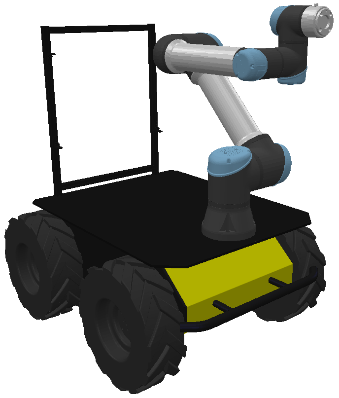
    <figcaption><em>Mobile manipulator consisting of a six degree of freedom industrial robotic manipulator (Universal Robots UR5e) mounted on a non-holonomic mobile platform (Clearpath Robotics Husky).</em></figcaption>
</figure>
<br/><br/>

```math
\begin{equation}
    \boldsymbol{\omega}_{b} = \begin{Bmatrix}
                    0 \\
                    0 \\
                    \omega
                    \end{Bmatrix} ,
    \mathbf{v}_{b} = \begin{Bmatrix}
                    v \\
                    0 \\
                    0
                    \end{Bmatrix} ,
    \mathbf{d}_{b} = \begin{Bmatrix}
                    0 \\
                    0 \\
                    0
                    \end{Bmatrix}  
\end{equation}
```
```math
\begin{equation}
    \boldsymbol{\omega}_{1} = \begin{Bmatrix}
                    0 \\
                    0 \\
                    \theta_{1}
                    \end{Bmatrix} ,
    \mathbf{v}_{1} = \begin{Bmatrix}
                    0 \\
                    0 \\
                    0
                    \end{Bmatrix} ,
    \mathbf{d}_{1} = \begin{Bmatrix}
                    0 \\
                    0 \\
                    0
                    \end{Bmatrix}  
\end{equation}
```
```math
\begin{equation}
    \boldsymbol{\omega}_{2} = \begin{Bmatrix}
                    0 \\
                    -\theta_{2} \\
                    0
                    \end{Bmatrix} ,
    \mathbf{v}_{2} = \begin{Bmatrix}
                    0 \\
                    0 \\
                    0
                    \end{Bmatrix} ,
    \mathbf{d}_{2} = \begin{Bmatrix}
                    0 \\
                    0 \\
                    H_{1}
                    \end{Bmatrix}  
\end{equation}
```
```math
\begin{equation}
    \boldsymbol{\omega}_{3} = \begin{Bmatrix}
                    0 \\
                    -\theta_{3} \\
                    0
                    \end{Bmatrix} ,
    \mathbf{v}_{3} = \begin{Bmatrix}
                    0 \\
                    0 \\
                    0
                    \end{Bmatrix} ,
    \mathbf{d}_{3} = \begin{Bmatrix}
                    -L_{1} \\
                    0 \\
                    H_{1}
                    \end{Bmatrix} 
\end{equation}
```
```math
\begin{equation}
    \boldsymbol{\omega}_{4} = \begin{Bmatrix}
                    0 \\
                    -\theta_{4} \\
                    0
                    \end{Bmatrix} ,
    \mathbf{v}_{4} = \begin{Bmatrix}
                    0 \\
                    0 \\
                    0
                    \end{Bmatrix} ,
    \mathbf{d}_{4} = \begin{Bmatrix}
                    -L_{1}-L_{2} \\
                    0 \\
                    H_{1}
                    \end{Bmatrix} 
\end{equation}
```
```math
\begin{equation}
    \boldsymbol{\omega}_{5} = \begin{Bmatrix}
                    0 \\
                    0 \\
                    -\theta_{5}
                    \end{Bmatrix} , 
    \mathbf{v}_{5} = \begin{Bmatrix}
                    0 \\
                    0 \\
                    0
                    \end{Bmatrix} , 
    \mathbf{d}_{5} = \begin{Bmatrix}
                    -L_{1}-L_{2} \\
                    -W_{1} \\
                    0
                    \end{Bmatrix} 
\end{equation}
```
```math
\begin{equation}
    \boldsymbol{\omega}_{6} = \begin{Bmatrix}
                    0 \\
                    -\theta_{6} \\
                    0
                    \end{Bmatrix} , 
    \mathbf{v}_{6} = \begin{Bmatrix}
                    0 \\
                    0 \\
                    0
                    \end{Bmatrix} , 
    \mathbf{d}_{6} = \begin{Bmatrix}
                    -L_{1}-L_{2} \\
                    0 \\
                    H_{1}-H_{2}
                    \end{Bmatrix} 
\end{equation}
```

```math
\begin{equation}
    \mathbf{S}_{b} = \begin{Bmatrix}
                    0 &
                    0 &
                    \omega &
                    v &
                    0 &
                    0
                    \end{Bmatrix}^{\top} 
\end{equation}
```
```math
\begin{equation}
    \mathbf{S}_{1} = \begin{Bmatrix}
                    0 &
                    0 &
                    1 &
                    0 &
                    0 &
                    0
                    \end{Bmatrix}^{\top} \theta_{1} 
\end{equation}
```
```math
\begin{equation}
    \mathbf{S}_{2} = \begin{Bmatrix}
                    0 &
                    -1 &
                    0 &
                    H_{1} &
                    0 &
                    0
                    \end{Bmatrix}^{\top} \theta_{2} 
\end{equation}
```
```math
\begin{equation}
    \mathbf{S}_{3} = \begin{Bmatrix}
                    0 &
                    -1 &
                    0 &
                    H_{1} &
                    0 &
                    L_{1}
                    \end{Bmatrix}^{\top} \theta_{3} 
\end{equation}
```
```math
\begin{equation}
    \mathbf{S}_{4} = \begin{Bmatrix}
                    0 &
                    -1 &
                    0 &
                    H_{1} &
                    0 &
                    L_{1}+L_{2}
                    \end{Bmatrix}^{\top} \theta_{4} 
\end{equation}
```
```math
\begin{equation}
    \mathbf{S}_{5} = \begin{Bmatrix}
                    0 &
                    0 &
                    -1 &
                    W_{1} &
                    -L_{1}-L_{2} &
                    0
                    \end{Bmatrix}^{\top} \theta_{5} 
\end{equation}
```
```math
\begin{equation}
    \mathbf{S}_{6} = \begin{Bmatrix}
                    0 &
                    -1 &
                    0 &
                    H_{1}-H_{2} &
                    0 &
                    L_{1}-L_{2}
                    \end{Bmatrix}^{\top} \theta_{6}
\end{equation}
```

```math
\begin{equation}
    [\mathbf{S}_{{b}}]^{\wedge} = \begin{bmatrix}
                            0 & -\omega & 0 & v \\
                            \omega & 0 & 0 & 0 \\
                            0 & 0 & 0 & 0 \\
                            0 & 0 & 0 & 0
                            \end{bmatrix} 
\end{equation}
```
```math
\begin{equation}
    [\mathbf{S}_{{1}}]^{\wedge} = \begin{bmatrix}
                            0 & -1 & 0 & 0 \\
                            1 & 0 & 0 & 0 \\
                            0 & 0 & 0 & 0 \\
                            0 & 0 & 0 & 0
                            \end{bmatrix} \theta_{1} 
\end{equation}
```
```math
\begin{equation}
    [\mathbf{S}_{{2}}]^{\wedge} = \begin{bmatrix}
                            0 & 0 & 1 & H_{1} \\
                            0 & 0 & 0 & 0 \\
                            -1 & 0 & 0 & 0 \\
                            0 & 0 & 0 & 0
                            \end{bmatrix} \theta_{2} 
\end{equation}
```
```math
\begin{equation}
    [\mathbf{S}_{{3}}]^{\wedge} = \begin{bmatrix}
                            0 & 0 & 1 & H_{1} \\
                            0 & 0 & 0 & 0 \\
                            -1 & 0 & 0 & L_{1} \\
                            0 & 0 & 0 & 0
                            \end{bmatrix} \theta_{3} 
\end{equation}
```
```math
\begin{equation}
    [\mathbf{S}_{{4}}]^{\wedge} = \begin{bmatrix}
                            0 & 0 & 1 & H_{1} \\
                            0 & 0 & 0 & 0 \\
                            -1 & 0 & 0 & L_{1}+L_{2} \\
                            0 & 0 & 0 & 0
                            \end{bmatrix} \theta_{4} 
\end{equation}
```
```math
\begin{equation}
    [\mathbf{S}_{{5}}]^{\wedge} = \begin{bmatrix}
                            0 & -1 & 0 & W_{1} \\
                            1 & 0 & 0 & -L_{1}-L_{2} \\
                            0 & 0 & 0 & 0 \\
                            0 & 0 & 0 & 0
                            \end{bmatrix} \theta_{5} 
\end{equation}
```
```math
\begin{equation}
    [\mathbf{S}_{{6}}]^{\wedge} = \begin{bmatrix}
                            0 & 0 & 1 & H_{1}-H_{2} \\
                            0 & 0 & 0 & 0 \\
                            -1 & 0 & 0 & L_{1}+L_{2} \\
                            0 & 0 & 0 & 0
                            \end{bmatrix} \theta_{6} 
\end{equation}
```
```math
\begin{equation}
    [\Delta\mathbf{P}^{B}_{B,k}] = \begin{bmatrix}
                            \cos{\omega_k} & -\sin{\omega_k} & 0 & \frac{v_k}{\omega_k}\sin{\omega_k} \\
                            \sin{\omega_k} & \cos{\omega_k} & 0 & \frac{v_k}{\omega_k}\left(1-\cos{\omega_k}\right) \\
                            0 & 0 & 1 & 0 \\
                            0 & 0 & 0 & 1
                            \end{bmatrix} dt 
\end{equation}
```
```math
\begin{equation}
    e^{[\mathbf{S}_{{1}}]^{\wedge}} = \begin{bmatrix}
                            \cos{\theta_{1}} & -\sin{\theta_{1}} & 0 & 0 \\
                            \sin{\theta_{1}} & \cos{\theta_{1}} & 0 & 0 \\
                            0 & 0 & 1 & 0 \\
                            0 & 0 & 0 & 1
                            \end{bmatrix} 
\end{equation}
```
```math
\begin{equation}
    e^{[\mathbf{S}_{{2}}]^{\wedge}} = \begin{bmatrix}
                            \cos{\theta_{2}} & 0 & \sin{\theta_{2}} & H_{1}\sin{\theta_{2}} \\
                            0 & 1 & 0 & 0 \\
                            -\sin{\theta_{2}} & 0 & \cos{\theta_{2}} & H_{1}\left(\cos{\theta_{2}}-1\right) \\
                            0 & 0 & 0 & 1
                            \end{bmatrix} 
\end{equation}
```
```math
\begin{equation}
    e^{[\mathbf{S}_{{3}}]^{\wedge}} = \begin{bmatrix}
                            \cos{\theta_{3}} & 0 & \sin{\theta_{3}} & H_{1}\sin{\theta_{3}} + L_{1}\left(1-\cos{\theta_{3}}\right) \\
                            0 & 1 & 0 & 0 \\
                            -\sin{\theta_{3}} & 0 & \cos{\theta_{3}} & H_{1}\left(\cos{\theta_{3}}-1\right) + L_{1}\sin{\theta_{3}} \\
                            0 & 0 & 0 & 1
                            \end{bmatrix} 
\end{equation}
```
```math
\begin{equation}
    e^{[\mathbf{S}_{{4}}]^{\wedge}} = \begin{bmatrix}
                            \cos{\theta_{4}} & 0 & \sin{\theta_{4}} & H_{1}\sin{\theta_{4}} + \left(L_{1}+L_{2}\right)\left(1-\cos{\theta_{4}}\right) \\
                            0 & 1 & 0 & 0 \\
                            -\sin{\theta_{4}} & 0 & \cos{\theta_{4}} & H_{1}\left(\cos{\theta_{4}}-1\right) + \left(L_{1}+L_{2}\right)\sin{\theta_{4}} \\
                            0 & 0 & 0 & 1
                            \end{bmatrix} 
\end{equation}
```
```math
\begin{equation}
    e^{[\mathbf{S}_{{5}}]^{\wedge}} = \begin{bmatrix}
                            \cos{\theta_{5}} & -\sin{\theta_{5}} & 0 & W_{1}\sin{\theta_{5}}-\left(L_{1}+L_{2}\right)\left(\cos{\theta_{5}}-1\right) \\
                            \sin{\theta_{5}} & \cos{\theta_{5}} & 0 & W_{1}\left(1-\cos{\theta_{5}}\right)-\left(L_{1}+L_{2}\right)\sin{\theta_{5}} \\
                            0 & 0 & 1 & 0 \\
                            0 & 0 & 0 & 1
                            \end{bmatrix} 
\end{equation}
```
```math
\begin{equation}
    e^{[\mathbf{S}_{{6}}]^{\wedge}} = \begin{bmatrix}
                            \cos{\theta_{6}} & 0 & \sin{\theta_{6}} & \left(H_{1}-H_{2}\right)\sin{\theta_{6}} + \left(L_{1}+L_{2}\right)\left(1-\cos{\theta_{6}}\right) \\
                            0 & 1 & 0 & 0 \\
                            -\sin{\theta_{6}} & 0 & \cos{\theta_{6}} & \left(H_{1}-H_{2}\right)\left(\cos{\theta_{6}}-1\right) + \left(L_{1}+L_{2}\right)\sin{\theta_{6}} \\
                            0 & 0 & 0 & 1
                            \end{bmatrix} 
\end{equation}
```

```math
\begin{equation}
    [\mathbf{P}^{B}_{0}] = \begin{bmatrix}
                            1 & 0 & 0 & -L_{1}-L_{2} \\
                            0 & 0 & -1 & -W_{1}-W_{2} \\
                            0 & 1 & 0 & H_{1}-H_{2} \\
                            0 & 0 & 0 & 1
                            \end{bmatrix}
\end{equation}
```

```math
\begin{equation}
    [\mathbf{P}^{W}_{E,k+1}] = [\mathbf{P}^{W}_{B,k}][\Delta\mathbf{P}^{B}_{B,k}]e^{[\mathbf{S}_{{1,k}}]^{\wedge}}e^{[\mathbf{S}_{{2,k}}]^{\wedge}}e^{[\mathbf{S}_{{3,k}}]^{\wedge}}e^{[\mathbf{S}_{{4,k}}]^{\wedge}}e^{[\mathbf{S}_{{5,k}}]^{\wedge}}e^{[\mathbf{S}_{{6,k}}]^{\wedge}}[\mathbf{P}^{B}_{0}]
\end{equation}
```

#### Mobile Manipulator with Holonomic Mobile Base

<figure>
    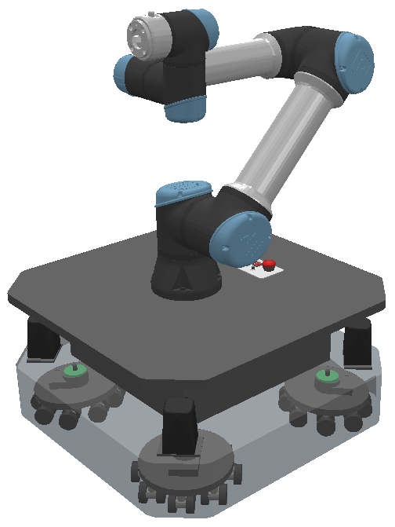
    <figcaption><em>Mobile manipulator consisting of a six degree of freedom industrial robotic manipulator (Universal Robots UR5e) mounted on a holonomic mobile platform.</em></figcaption>
</figure>
<br/><br/>

```math
\begin{equation}
    \boldsymbol{\omega}_{b} = \begin{Bmatrix}
                    0 \\
                    0 \\
                    \omega
                    \end{Bmatrix} , 
    \mathbf{v}_{b} = \begin{Bmatrix}
                    v_{x} \\
                    v_{y} \\
                    0
                    \end{Bmatrix} , 
    \mathbf{d}_{b} = \begin{Bmatrix}
                    0 \\
                    0 \\
                    0
                    \end{Bmatrix}  
\end{equation}
```
```math
\begin{equation}
    \boldsymbol{\omega}_{1} = \begin{Bmatrix}
                    0 \\
                    0 \\
                    \theta_{1}
                    \end{Bmatrix} , 
    \mathbf{v}_{1} = \begin{Bmatrix}
                    0 \\
                    0 \\
                    0
                    \end{Bmatrix} , 
    \mathbf{d}_{1} = \begin{Bmatrix}
                    0 \\
                    0 \\
                    0
                    \end{Bmatrix}  
\end{equation}
```
```math
\begin{equation}
    \boldsymbol{\omega}_{2} = \begin{Bmatrix}
                    0 \\
                    -\theta_{2} \\
                    0
                    \end{Bmatrix} , 
    \mathbf{v}_{2} = \begin{Bmatrix}
                    0 \\
                    0 \\
                    0
                    \end{Bmatrix} , 
    \mathbf{d}_{2} = \begin{Bmatrix}
                    0 \\
                    0 \\
                    H_{1}
                    \end{Bmatrix}  
\end{equation}
```
```math
\begin{equation}
    \boldsymbol{\omega}_{3} = \begin{Bmatrix}
                    0 \\
                    -\theta_{3} \\
                    0
                    \end{Bmatrix} , 
    \mathbf{v}_{3} = \begin{Bmatrix}
                    0 \\
                    0 \\
                    0
                    \end{Bmatrix} , 
    \mathbf{d}_{3} = \begin{Bmatrix}
                    -L_{1} \\
                    0 \\
                    H_{1}
                    \end{Bmatrix} 
\end{equation}
```
```math
\begin{equation}
    \boldsymbol{\omega}_{4} = \begin{Bmatrix}
                    0 \\
                    -\theta_{4} \\
                    0
                    \end{Bmatrix} , 
    \mathbf{v}_{4} = \begin{Bmatrix}
                    0 \\
                    0 \\
                    0
                    \end{Bmatrix} , 
    \mathbf{d}_{4} = \begin{Bmatrix}
                    -L_{1}-L_{2} \\
                    0 \\
                    H_{1}
                    \end{Bmatrix} 
\end{equation}
```
```math
\begin{equation}
    \boldsymbol{\omega}_{5} = \begin{Bmatrix}
                    0 \\
                    0 \\
                    -\theta_{5}
                    \end{Bmatrix} , 
    \mathbf{v}_{5} = \begin{Bmatrix}
                    0 \\
                    0 \\
                    0
                    \end{Bmatrix} , 
    \mathbf{d}_{5} = \begin{Bmatrix}
                    -L_{1}-L_{2} \\
                    -W_{1} \\
                    0
                    \end{Bmatrix} 
\end{equation}
```
```math
\begin{equation}
    \boldsymbol{\omega}_{6} = \begin{Bmatrix}
                    0 \\
                    -\theta_{6} \\
                    0
                    \end{Bmatrix} , 
    \mathbf{v}_{6} = \begin{Bmatrix}
                    0 \\
                    0 \\
                    0
                    \end{Bmatrix} , 
    \mathbf{d}_{6} = \begin{Bmatrix}
                    -L_{1}-L_{2} \\
                    0 \\
                    H_{1}-H_{2}
                    \end{Bmatrix} 
\end{equation}
```

```math
\begin{equation}
    \mathbf{S}_{b} = \begin{Bmatrix}
                    0 &
                    0 &
                    \omega &
                    v_{x} &
                    v_{y} &
                    0
                    \end{Bmatrix}^{\top} 
\end{equation}
```
```math
\begin{equation}
    \mathbf{S}_{1} = \begin{Bmatrix}
                    0 &
                    0 &
                    1 &
                    0 &
                    0 &
                    0
                    \end{Bmatrix}^{\top} \theta_{1} 
\end{equation}
```
```math
\begin{equation}
    \mathbf{S}_{2} = \begin{Bmatrix}
                    0 &
                    -1 &
                    0 &
                    H_{1} &
                    0 &
                    0
                    \end{Bmatrix}^{\top} \theta_{2} 
\end{equation}
```
```math
\begin{equation}
    \mathbf{S}_{3} = \begin{Bmatrix}
                    0 &
                    -1 &
                    0 &
                    H_{1} &
                    0 &
                    L_{1}
                    \end{Bmatrix}^{\top} \theta_{3} 
\end{equation}
```
```math
\begin{equation}
    \mathbf{S}_{4} = \begin{Bmatrix}
                    0 &
                    -1 &
                    0 &
                    H_{1} &
                    0 &
                    L_{1}+L_{2}
                    \end{Bmatrix}^{\top} \theta_{4} 
\end{equation}
```
```math
\begin{equation}
    \mathbf{S}_{5} = \begin{Bmatrix}
                    0 &
                    0 &
                    -1 &
                    W_{1} &
                    -L_{1}-L_{2} &
                    0
                    \end{Bmatrix}^{\top} \theta_{5} 
\end{equation}
```
```math
\begin{equation}
    \mathbf{S}_{6} = \begin{Bmatrix}
                    0 &
                    -1 &
                    0 &
                    H_{1}-H_{2} &
                    0 &
                    L_{1}-L_{2}
                    \end{Bmatrix}^{\top} \theta_{6}
\end{equation}
```

```math
\begin{equation}
    [\mathbf{S}_{{b}}]^{\wedge} = \begin{bmatrix}
                            0 & -\omega & 0 & v_{x} \\
                            \omega & 0 & 0 & v_{y} \\
                            0 & 0 & 0 & 0 \\
                            0 & 0 & 0 & 0
                            \end{bmatrix} 
\end{equation}
```
```math
\begin{equation}
    [\mathbf{S}_{{1}}]^{\wedge} = \begin{bmatrix}
                            0 & -1 & 0 & 0 \\
                            1 & 0 & 0 & 0 \\
                            0 & 0 & 0 & 0 \\
                            0 & 0 & 0 & 0
                            \end{bmatrix} \theta_{1} 
\end{equation}
```
```math
\begin{equation}
    [\mathbf{S}_{{2}}]^{\wedge} = \begin{bmatrix}
                            0 & 0 & 1 & H_{1} \\
                            0 & 0 & 0 & 0 \\
                            -1 & 0 & 0 & 0 \\
                            0 & 0 & 0 & 0
                            \end{bmatrix} \theta_{2}
\end{equation}
```
```math
\begin{equation}
    [\mathbf{S}_{{3}}]^{\wedge} = \begin{bmatrix}
                            0 & 0 & 1 & H_{1} \\
                            0 & 0 & 0 & 0 \\
                            -1 & 0 & 0 & L_{1} \\
                            0 & 0 & 0 & 0
                            \end{bmatrix} \theta_{3} 
\end{equation}
```
```math
\begin{equation}
    [\mathbf{S}_{{4}}]^{\wedge} = \begin{bmatrix}
                            0 & 0 & 1 & H_{1} \\
                            0 & 0 & 0 & 0 \\
                            -1 & 0 & 0 & L_{1}+L_{2} \\
                            0 & 0 & 0 & 0
                            \end{bmatrix} \theta_{4} 
\end{equation}
```
```math
\begin{equation}
    [\mathbf{S}_{{5}}]^{\wedge} = \begin{bmatrix}
                            0 & -1 & 0 & W_{1} \\
                            1 & 0 & 0 & -L_{1}-L_{2} \\
                            0 & 0 & 0 & 0 \\
                            0 & 0 & 0 & 0
                            \end{bmatrix} \theta_{5} 
\end{equation}
```
```math
\begin{equation}
    [\mathbf{S}_{{6}}]^{\wedge} = \begin{bmatrix}
                            0 & 0 & 1 & H_{1}-H_{2} \\
                            0 & 0 & 0 & 0 \\
                            -1 & 0 & 0 & L_{1}+L_{2} \\
                            0 & 0 & 0 & 0
                            \end{bmatrix} \theta_{6} 
\end{equation}
```

```math
\begin{equation}
    [\Delta\mathbf{P}^{B}_{B,k}] = \begin{bmatrix}
                            \cos{\omega_k} & -\sin{\omega_k} & 0 & \frac{v_{x,k}\sin{\omega_k}+v_{y,k}\left(\cos{\omega_k}-1\right)}{\omega_k} \\
                            \sin{\omega_k} & \cos{\omega_k} & 0 & \frac{v_{y,k}\sin{\omega_k}+v_{x,k}\left(1-\cos{\omega_k}\right)}{\omega_k} \\
                            0 & 0 & 1 & 0 \\
                            0 & 0 & 0 & 1
                            \end{bmatrix} dt 
\end{equation}
```
```math
\begin{equation}
    e^{[\mathbf{S}_{{1}}]^{\wedge}} = \begin{bmatrix}
                            \cos{\theta_{1}} & -\sin{\theta_{1}} & 0 & 0 \\
                            \sin{\theta_{1}} & \cos{\theta_{1}} & 0 & 0 \\
                            0 & 0 & 1 & 0 \\
                            0 & 0 & 0 & 1
                            \end{bmatrix} 
\end{equation}
```
```math
\begin{equation}
    e^{[\mathbf{S}_{{2}}]^{\wedge}} = \begin{bmatrix}
                            \cos{\theta_{2}} & 0 & \sin{\theta_{2}} & H_{1}\sin{\theta_{2}} \\
                            0 & 1 & 0 & 0 \\
                            -\sin{\theta_{2}} & 0 & \cos{\theta_{2}} & H_{1}\left(\cos{\theta_{2}}-1\right) \\
                            0 & 0 & 0 & 1
                            \end{bmatrix} 
\end{equation}
```
```math
\begin{equation}
    e^{[\mathbf{S}_{{3}}]^{\wedge}} = \begin{bmatrix}
                            \cos{\theta_{3}} & 0 & \sin{\theta_{3}} & H_{1}\sin{\theta_{3}} + L_{1}\left(1-\cos{\theta_{3}}\right) \\
                            0 & 1 & 0 & 0 \\
                            -\sin{\theta_{3}} & 0 & \cos{\theta_{3}} & H_{1}\left(\cos{\theta_{3}}-1\right) + L_{1}\sin{\theta_{3}} \\
                            0 & 0 & 0 & 1
                            \end{bmatrix} 
\end{equation}
```
```math
\begin{equation}
    e^{[\mathbf{S}_{{4}}]^{\wedge}} = \begin{bmatrix}
                            \cos{\theta_{4}} & 0 & \sin{\theta_{4}} & H_{1}\sin{\theta_{4}} + \left(L_{1}+L_{2}\right)\left(1-\cos{\theta_{4}}\right) \\
                            0 & 1 & 0 & 0 \\
                            -\sin{\theta_{4}} & 0 & \cos{\theta_{4}} & H_{1}\left(\cos{\theta_{4}}-1\right) + \left(L_{1}+L_{2}\right)\sin{\theta_{4}} \\
                            0 & 0 & 0 & 1
                            \end{bmatrix} 
\end{equation}
```
```math
\begin{equation}
    e^{[\mathbf{S}_{{5}}]^{\wedge}} = \begin{bmatrix}
                            \cos{\theta_{5}} & -\sin{\theta_{5}} & 0 & W_{1}\sin{\theta_{5}}-\left(L_{1}+L_{2}\right)\left(\cos{\theta_{5}}-1\right) \\
                            \sin{\theta_{5}} & \cos{\theta_{5}} & 0 & W_{1}\left(1-\cos{\theta_{5}}\right)-\left(L_{1}+L_{2}\right)\sin{\theta_{5}} \\
                            0 & 0 & 1 & 0 \\
                            0 & 0 & 0 & 1
                            \end{bmatrix} 
\end{equation}
```
```math
\begin{equation}
    e^{[\mathbf{S}_{{6}}]^{\wedge}} = \begin{bmatrix}
                            \cos{\theta_{6}} & 0 & \sin{\theta_{6}} & \left(H_{1}-H_{2}\right)\sin{\theta_{6}} + \left(L_{1}+L_{2}\right)\left(1-\cos{\theta_{6}}\right) \\
                            0 & 1 & 0 & 0 \\
                            -\sin{\theta_{6}} & 0 & \cos{\theta_{6}} & \left(H_{1}-H_{2}\right)\left(\cos{\theta_{6}}-1\right) + \left(L_{1}+L_{2}\right)\sin{\theta_{6}} \\
                            0 & 0 & 0 & 1
                            \end{bmatrix} 
\end{equation}
```

```math
\begin{equation}
    [\mathbf{P}^{B}_{0}] = \begin{bmatrix}
                            1 & 0 & 0 & -L_{1}-L_{2} \\
                            0 & 0 & -1 & -W_{1}-W_{2} \\
                            0 & 1 & 0 & H_{1}-H_{2} \\
                            0 & 0 & 0 & 1
                            \end{bmatrix}
\end{equation}
```

```math
\begin{equation}
    [\mathbf{P}^{W}_{E,k+1}] = [\mathbf{P}^{W}_{B,k}][\Delta\mathbf{P}^{B}_{B,k}]e^{[\mathbf{S}_{{1,k}}]^{\wedge}}e^{[\mathbf{S}_{{2,k}}]^{\wedge}}e^{[\mathbf{S}_{{3,k}}]^{\wedge}}e^{[\mathbf{S}_{{4,k}}]^{\wedge}}e^{[\mathbf{S}_{{5,k}}]^{\wedge}}e^{[\mathbf{S}_{{6,k}}]^{\wedge}}[\mathbf{P}^{B}_{0}]
\end{equation}
```

## Citation

If you found this repository useful please consider citing:

```
@misc{smith2024lietheorybasedoptimization,
      title={Lie Theory Based Optimization for Unified State Planning of Mobile Manipulators}, 
      author={William Smith and Siddharth Singh and Julia Rudy and Yuxiang Guan},
      year={2024},
      eprint={2410.15443},
      archivePrefix={arXiv},
      primaryClass={cs.RO},
      url={https://arxiv.org/abs/2410.15443}, 
}
```
